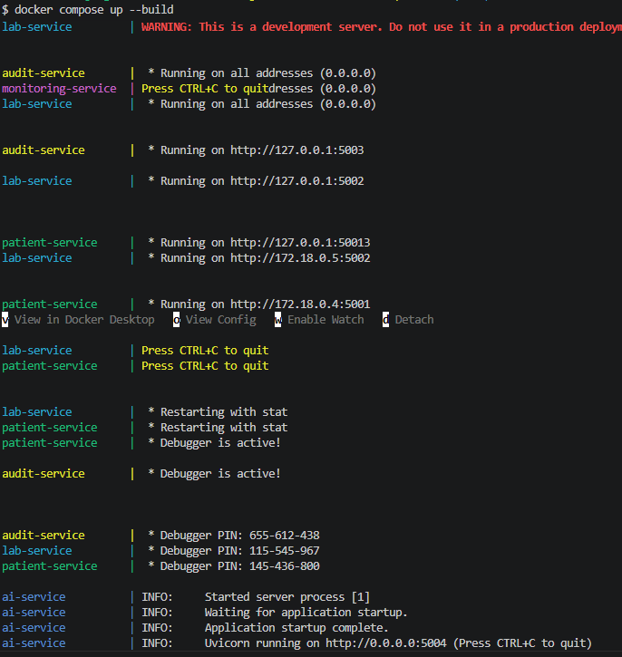
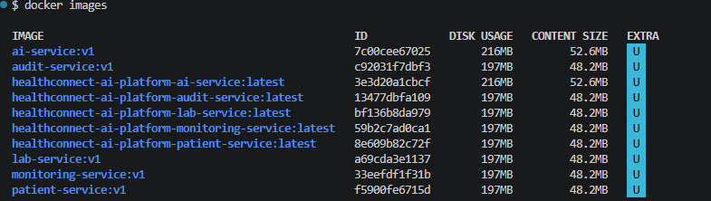
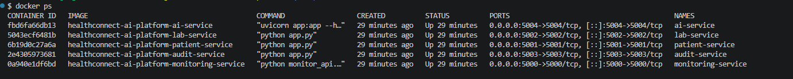
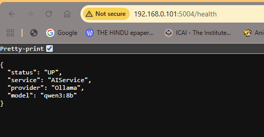
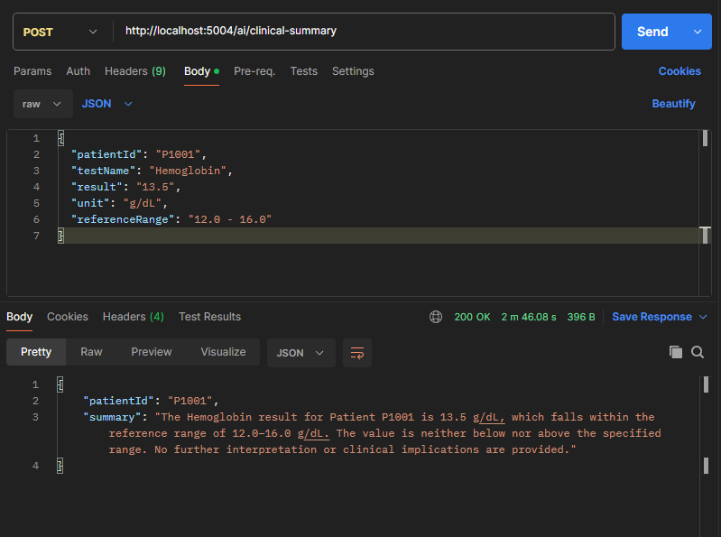

# Docker Deployment Guide

## Overview

The HealthConnect AI Platform has been successfully containerized using Docker and Docker Compose.

This guide describes the container architecture, build process, deployment process, networking configuration, and validation steps.

---

## Containerized Services

| Service            | Technology | Port |
| ------------------ | ---------- | ---- |
| PatientService     | Flask      | 5001 |
| LabService         | Flask      | 5002 |
| AuditService       | Flask      | 5003 |
| Monitoring Service | Flask      | 5000 |
| AIService          | FastAPI    | 5004 |

---

## External Components

The following components remain on the host machine and are not containerized in the current release:

| Component                        | Purpose            |
| -------------------------------- | ------------------ |
| IBM App Connect Enterprise (ACE) | Integration Layer  |
| IBM MQ                           | Messaging Platform |
| Ollama                           | Local LLM Runtime  |
| Qwen3:8b                         | AI Model           |

---

## Docker Architecture

```text
Docker Compose
│
├── Patient Service      :5001
├── Lab Service          :5002
├── Audit Service        :5003
├── Monitoring Service   :5000
└── AI Service           :5004
           │
           ▼
host.docker.internal
           │
           ▼
Ollama
           │
           ▼
Qwen3:8b
```

---

## Docker Compose Deployment

The complete platform can be started using a single command.

```bash
docker compose up --build
```

### Docker Compose Execution



All services are automatically built, networked, and started.

---

## Docker Images

Docker images were created for all microservices.

### Docker Images



Images built:

* patient-service
* lab-service
* audit-service
* monitoring-service
* ai-service

---

## Running Containers

After deployment, all containers run simultaneously.

### Running Containers



Verification command:

```bash
docker ps
```

---

## Dockerfiles

Each service contains an independent Dockerfile.

Example:

```dockerfile
FROM python:3.12-slim

WORKDIR /app

ENV PYTHONUNBUFFERED=1

COPY requirements.txt .

RUN pip install --no-cache-dir -r requirements.txt

COPY . .

EXPOSE 5001

CMD ["python", "app.py"]
```

---

## Docker Compose Configuration

The platform is orchestrated using Docker Compose.

Example:

```yaml
services:

  patient-service:
    build:
      context: ./PatientService
    container_name: patient-service
    ports:
      - "5001:5001"

  lab-service:
    build:
      context: ./LabService
    container_name: lab-service
    ports:
      - "5002:5002"

  audit-service:
    build:
      context: ./AuditService
    container_name: audit-service
    ports:
      - "5003:5003"

  monitoring-service:
    build:
      context: ./Monitoring
    container_name: monitoring-service
    ports:
      - "5000:5000"

  ai-service:
    build:
      context: ./AI/AIService
    container_name: ai-service
    ports:
      - "5004:5004"
```

---

## Container Networking

Docker Compose automatically creates an internal network.

Services communicate using service names instead of IP addresses.

Example:

```text
http://monitoring-service:5000
```

instead of:

```text
http://192.168.x.x
```

Benefits:

* No hardcoded IPs
* Automatic service discovery
* Simplified microservice communication

---

## Host Communication

The AI Service communicates with Ollama running on the host machine.

Configuration:

```python
OLLAMA_URL = "http://host.docker.internal:11434/api/generate"
```

Why?

Inside a container:

```text
localhost
```

refers to the container itself, not the host machine.

Docker Desktop provides:

```text
host.docker.internal
```

to allow container-to-host communication.

---

## AI Service Validation

### AI Health Endpoint



Validation:

```http
GET /health
```

Response:

```json
{
  "status": "UP",
  "service": "AIService",
  "provider": "Ollama",
  "model": "qwen3:8b"
}
```

---

## AI Clinical Summary Validation

### Clinical Summary Generation



Validation:

```http
POST /ai/clinical-summary
```

The AI Service successfully generated clinical summaries using:

* Ollama
* Qwen3:8b
* FastAPI

while running inside a Docker container.

---

## Verification Checklist

Successfully validated:

* Docker image creation
* Docker container creation
* Port mapping
* Docker Compose orchestration
* Service-to-service communication
* Container-to-host communication
* AIService to Ollama connectivity
* Clinical Summary generation
* Incident Analysis generation
* Monitoring API integration

---

## Troubleshooting

### View Running Containers

```bash
docker ps
```

### View All Containers

```bash
docker ps -a
```

### View Logs

```bash
docker logs <container-id>
```

Example:

```bash
docker logs ai-service
```

### Stop Platform

```bash
docker compose down
```

### Rebuild Platform

```bash
docker compose up --build
```

---

## Lessons Learned

* Docker images package application code and dependencies.
* Containers are running instances of Docker images.
* Docker Compose simplifies orchestration of multiple microservices.
* Service discovery removes the need for hardcoded IP addresses.
* host.docker.internal enables communication between containers and host services.
* Not all dependencies need to be containerized initially.
* Incremental containerization reduces project complexity.

---

## Release Information

Release Version:

v1.2

Release Name:

Dockerized Healthcare Integration Platform

Status:

✅ Successfully Completed
